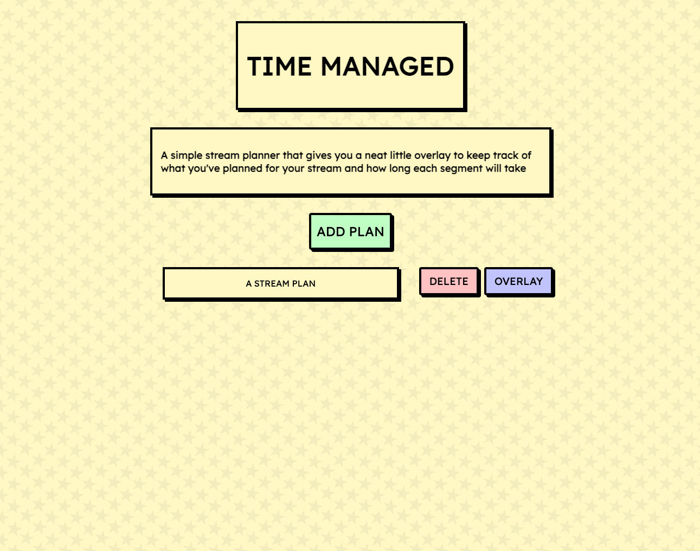
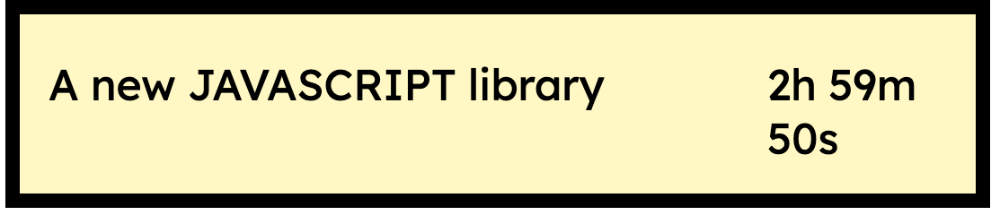

## TIMEMANAGED


*Time, when managed adeptly, transforms into a conduit of pure delight, for in its judicious embrace, "time managed is time enjoyed."* - ChatGPT Plato

Time Managed is a simple stream planner that gives you a neat little overlay to keep track of what you've planned for your stream and how long each segment will take.

### Usage

Install node & npm then run the following commands in the root directory

```bash
$ npm i
$ npm run build && npm start
```

Navigate to http://localhost:3030 to get started

#### Create A plan

Since you ave not created a plan before, there'll be a green button "GET STARTED", click it to go to the create plan page.


The heading "NEW STREAM PLAN" is editable, edit it to name your plan.


You edit the inputs to describe a task. The longer input contains the name of the task and the second input contains the time you plan for it to take. It must be in the format "1h1m1s", where _h_ is the number of hours, _m_ is the number of minutes and _s_ is the number of seconds.

You can also click the

- "ADD" button to add a new task
- "DELETE" button after focusing on a task input to delete it
- "SAVE" button to save your plan, this will show an alert with the path to your overlay that you can add as a browser source to OBS. (Please remember to prepend the path with the address of the server which is http://localhost:3030 by default)


#### Edit A Plan

When you're back at the home page, you'll see your stream plan. You can click it to go back to editing it

You can also click the DELETE button to delete the plan and the OVERLAY button to show an alert with the plan's overlay path.



#### Add The Overlay

With the overlay path, you can add it to OBS as a browser source. Please ensure to use the following dimensions for the browser view 1300x250



please note that the timer restarts when you reload the overlay page

## THANKS FOR READING!!!!